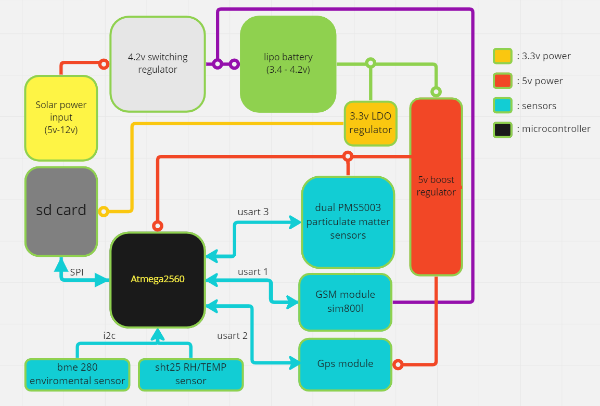

# AirQo-hardware
The AirQo air quality monitoring device is an IoT connected device that provides realtime measurement of particualate matter concentrations and environmental readings (atmospheric pressure, relative humidity and temperature). The device is powered by a Li-ion battery and connects to the internet over a 2G GSM network.
## Folder Structure
- [**Firmware**](./firmware)
    - Contains the various firmware projects for AirQo hardware, specific to different build environments.
- [**Hardware**](./hardware)
    - Contains the hardware designs for AirQo hardware, 3d models for 3d printing, Schematic and PCB designs.
- [**docs**](./docs)
    - Contains relevant documentation and templates.
## Hardware design
The device is currently designed around an [Atmega2560](https://ww1.microchip.com/downloads/aemDocuments/documents/OTH/ProductDocuments/DataSheets/ATmega640-1280-1281-2560-2561-Datasheet-DS40002211A.pdf) microcontroller, that hosts the device firmware.
### block diagram 

### Sensors
* Particulate matter sensors [Plantower Pms5003]()

* Environmental sensors     [BME280](),[SHT25]()

* GPS                        [NEO6-GPS-module]()

* Communication              [Sim800l-GSM-GPRS]()

### CAD tools
List of tools used to design the AirQo monitor
PCB tools, 3d tools, links to design files here on github

## Firmware design
### Developed with cpp and arduino framework
The firmware provides the AirQo monitor with a number of features
* Realtime measurements of particulate matter concentrations
* Logging of data to local storage
* Over The Air Firmware Updates (OTA)
## License
This project is licensed under the MIT License - see the [LICENSE.md](LICENSE.md) file for details
