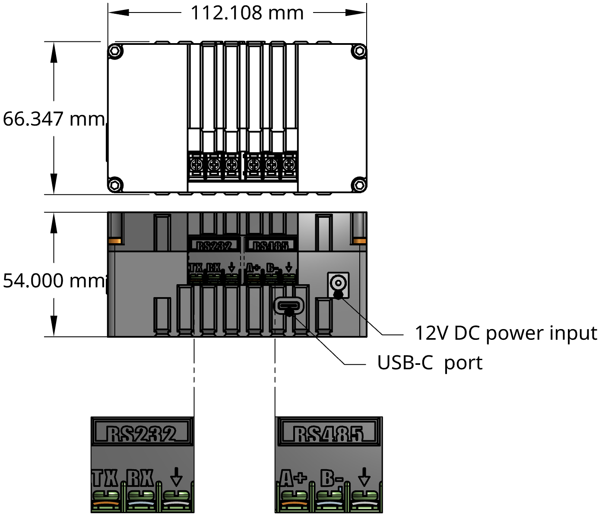
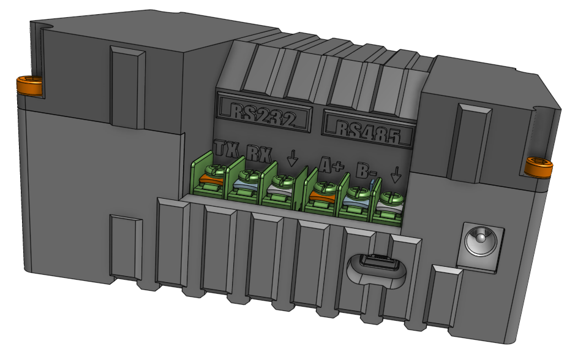

# BAM Data Logger

> **Document:** AirQo Data Logger User Manual · Feb 23, 2026

---

## Introduction

AirQo Data Logger is a remote data logging solution specifically for the **BAM1022** reference air quality monitoring system. The logger utilizes the available communication ports on the BAM1022 to periodically retrieve data from the system and stream it to AirQo data platforms.

---

## Know Your Device

The AirQo Data Logger is a compact enclosure that mounts alongside the BAM1022. It exposes several communication interfaces on its breakout panel:

| Interface | Connector |
|---|---|
| CS I/O communications port | — |
| RS-232 serial port | DB9 male |
| RS-485 serial port | DB9 female |
| USB serial / debug | USB-C |
| DC Power input | Barrel connector |

---

## Quick Links

| Section | Description |
|---|---|
| [Technical Specification](technical-spec.md) | Dimensions, power, cellular and data specs |
| [Installation](installation.md) | Connecting to the BAM1022, wiring, and powering |
| [Data Access](data-access.md) | Accessing data via AirQo platform and serial debug |

---

## Related Pages

- [Device Overview](../device/overview.md) — AirQo Binos Air Monitor
- [Deployment](../deployment.md) — General deployment guidance
