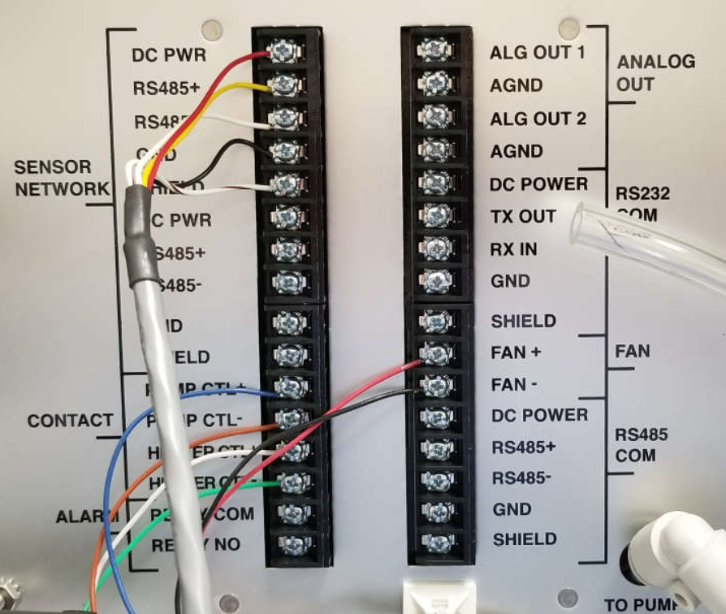
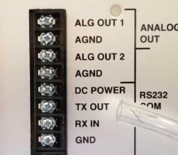
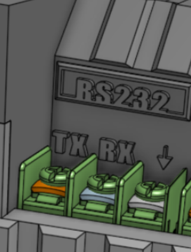
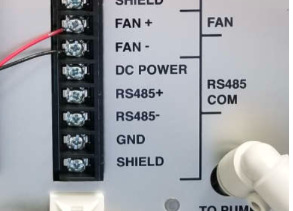
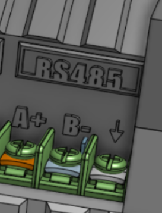
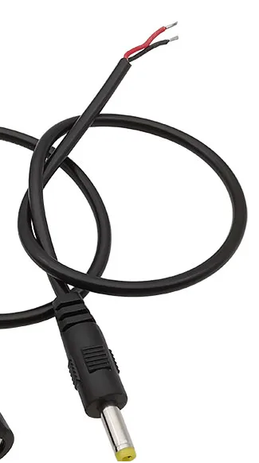
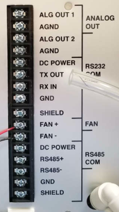

# Installation — Connecting to the BAM1022

---

## Tools Required

1. Phillips screwdriver
2. Wire strippers / pliers
3. 5× extension wires (~30cm each) — included in the device package

---

## Connection Procedure

### Step 1 — Access the BAM1022 Back Panel

Unscrew the **4 butterfly nuts** securing the back panel of the BAM1022 to expose the power ports and external communication ports.

---

## Serial Communication Connections

Make the following connections between the **BAM1022 expansion interface** and the **AirQo Data Logger communication breakout**:

| BAM1022 Expansion Interface | AirQo Data Logger |
|---|---|
| TX OUT | TX |
| RX IN | RX |
| RS485+ | A+ |
| RS485- | B- |
| GND | GND |

!!! note
    Use the supplied extension wires, cut to appropriate lengths.

---

### RS-232 Setup

Three wires are required: **GND**, **TXOUT**, and **RX IN**.

1. Connect **GND** from BAM1022 → **GND** on the data logger
2. Connect **TXOUT** from BAM1022 → **TX** on the data logger
3. Connect **RX IN** from BAM1022 → **RX** on the data logger

---

### RS-485 Setup

Three wires are required: **GND**, **RS485+**, and **RS485-**.

1. Connect **GND** from BAM1022 → **GND** on the data logger
2. Connect **RS485+** from BAM1022 → **A+** on the data logger
3. Connect **RS485-** from BAM1022 → **B-** on the data logger

---

## Powering the Data Logger

12V power is drawn from the BAM1022's **DC POWER** port.

| BAM1022 Expansion Interface | AirQo Data Logger Power Cable |
|---|---|
| DC POWER | Red wire (+) |
| GND | Black wire (−) |

Connect the wires to the supplied DC power barrel connector cable (paying attention to polarity), then plug into the **DC power port** on the data logger.

!!! info "Internal Battery"
    The data logger has an internal Li-ion battery that provides **backup power** in case of power interruptions from the BAM1022. It charges automatically when 12V power is connected.

!!! warning
    The data logger's internal battery does **not** provide backup power for the BAM1022 itself.

---

## Important Checks

!!! warning "Baud Rate"
    The data logger operates at a serial communication baud rate of **9600 bps** by default. This baud rate **must match** on both the data logger and the BAM1022's communication interfaces. Verify this in the BAM1022 user manual before operating.

---

## Related Pages

- [Data Logger Overview](index.md)
- [Technical Specification](technical-spec.md)
- [Data Access](data-access.md)
