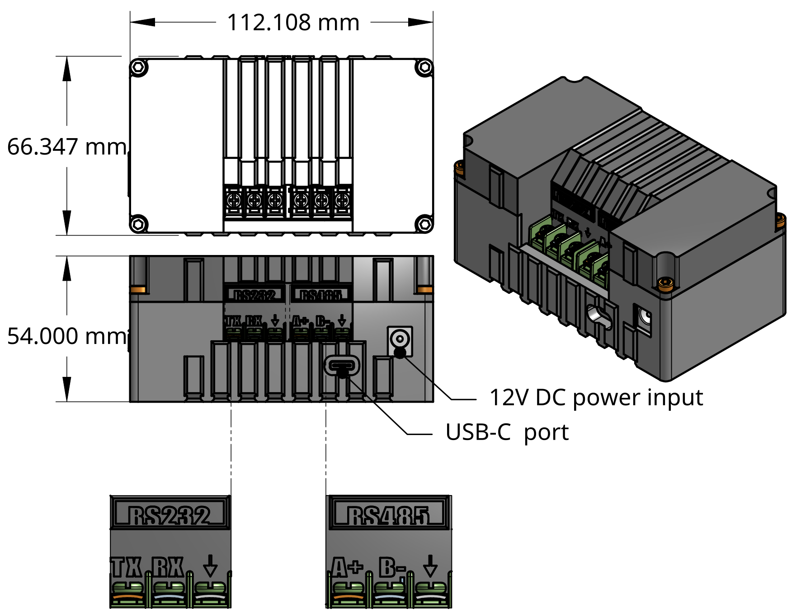

# Data Logger — Technical Specification

---

## General

| Parameter | Value |
|---|---|
| **Certifications** | None |
| **Dimensions** | 112.85 × 55.18 × 54.86 mm |
| **Weight** | 215.5 g |
| **Deployment setting** | Outdoor / ambient conditions |
| **Operating temperature** | 0–45 °C |

!!! warning
    Not compatible with fire, flames, or immersion in water.

---

## Host Interface

| Port | Type |
|---|---|
| CS I/O communications port | — |
| RS-232 serial port | DB9 male |
| RS-485 serial port | DB9 female |
| USB | Version 2.0 with USB-C connector |

---

## Power

| Parameter | Value |
|---|---|
| **Input voltage** | 5–12V |
| **Battery** | 3.7V Li-ion 3.5AH |
| **Power — Active** | 1.1W |
| **Power — Save mode** | 0.098W |
| **Current draw — Normal use** | 220mA |
| **Current draw — Save mode** | 19.6mA |
| **Current draw — Transmission** | 300mA |

---

## Cellular Communication

| Parameter | Value |
|---|---|
| **Network technology** | Quad-band GSM/GPRS 2G |
| **Frequencies** | GSM/GPRS 850MHz · GSM EDGE 900MHz · DCS 1800MHz · PCS 1900MHz |
| **Data accessibility** | AirQo Dashboard · AirQo API · AirQo App |

---

## Data Speeds

| Technology | Download | Upload |
|---|---|---|
| LTE | Max 10 Mbps | Max 5 Mbps |
| WCDMA | Max 384 Kbps | Max 384 Kbps |
| GSM GPRS | Max 107 Kbps | Max 85.6 Kbps |
| GSM EDGE | Max 296 Kbps | Max 236.8 Kbps |
| RS-232 / RS-485 | 9600 bps – 460.8 Kbps | 9600 bps – 460.8 Kbps |

---

## Technical Drawings

---

## Related Pages

- [Data Logger Overview](index.md)
- [Installation](installation.md)
- [Data Access](data-access.md)
