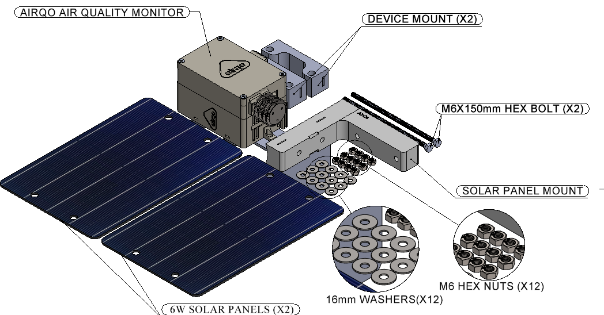
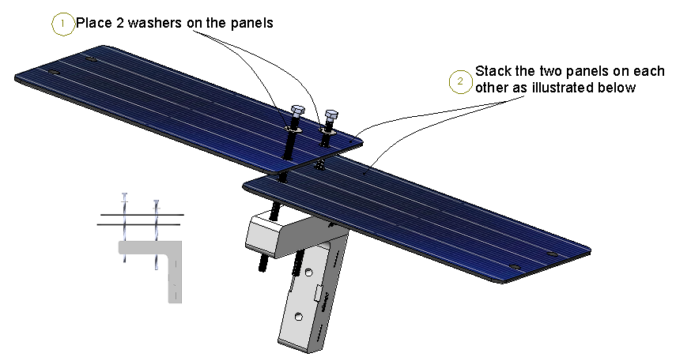
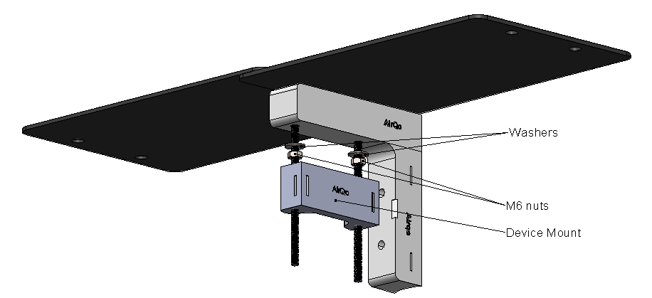
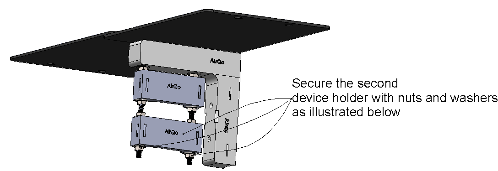
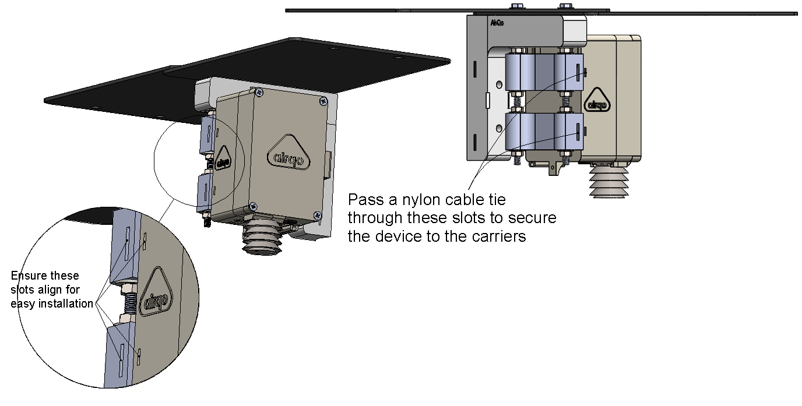
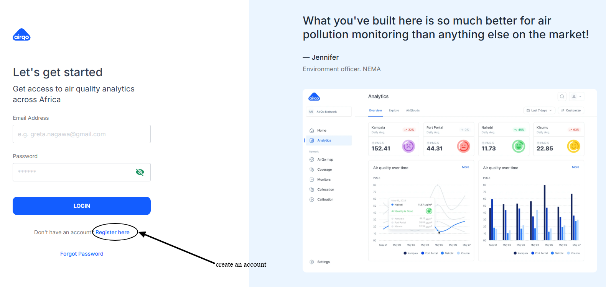
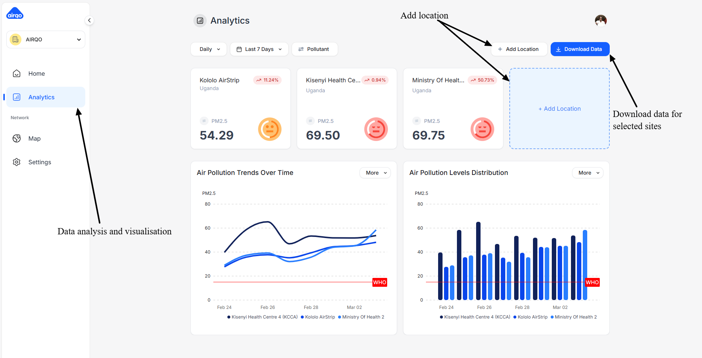
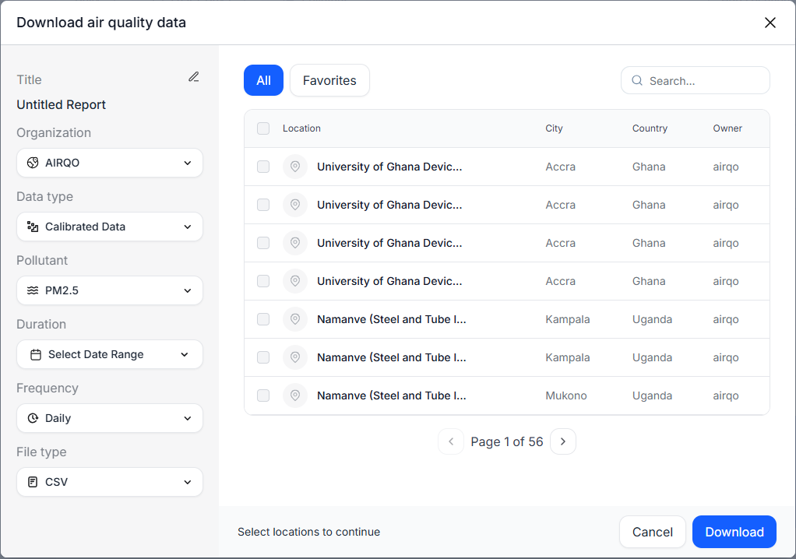

# Deployment Guide

This provides information on how to deploy the AirQo device onto the AirQo analytics platform successfully. This section guides on installing the monitor using the included toolkit. Mounting equipment for pole, wall, or face installation is provided along with step-by-step guidance.

---

## Installation Toolkit

The installation kit includes:

- Device carrier brackets
- Mounting bolts, washers, and nuts
- Pole/wall mounting hardware
- Tool kit for assembly

---

## Installation Site Selection Guidelines

When selecting an installation site, consider:

| Factor | Guideline |
|---|---|
| **Height** | Mount at 2–5 metres above ground level |
| **Airflow** | Avoid locations blocked by walls or vegetation |
| **Sun exposure** | Solar panel must face direction of maximum sunlight |
| **Network** | Verify 2G GSM signal available at the site |
| **Security** | Choose a location that minimises risk of tampering |

---

## Installation Procedure

!!! warning
    Ensure the device is powered off before mounting.

**Step 1:** Attach the first device carrier to the mounting pole and fasten securely.

**Step 2:** Measure approximately 5cm after the first device carrier, then attach the second device carrier and fasten with two washers and 2 nuts.

**Step 3:** Mount the AirQo monitor onto the assembled carrier brackets.

**Step 4:** After assembly, verify the device is securely mounted and the solar panel is correctly oriented.

!!! tip
    After assembly, the device should be stable with the solar panel unobstructed and sensors exposed to ambient air.

---

## Data Access

### Creating an Account

Visit the [AirQo Analytics Platform](https://analytics.airqo.net) and click **Register**. You will receive an email to verify your account.

### Accessing Analytics

After logging in, navigate to the **Analytics** option on the left side of the Dashboard.

### Adding a Location

Under the **Analytics** tab, click **Add Location** to register your deployment site.

### Viewing Real-Time Data

Select a maximum of **4 sites** to view their data in real time. Highlight the site locations you want to visualise.

---

## Related Pages

- [Device Overview](device/overview.md) — Understanding what the device measures
- [Technical Specification](device/technical-spec.md) — Hardware specifications
- [Maintenance](maintenance/index.md) — Keeping the device running optimally
