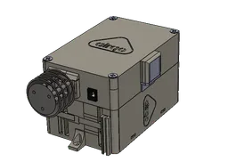
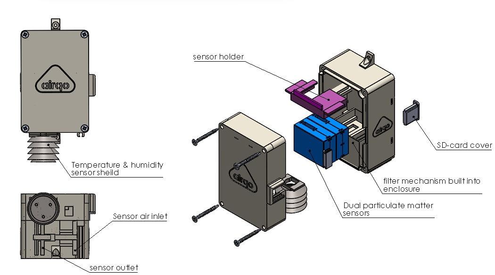

# Device Overview

> **Tags:** Onboarding, Technical Support

---

## Know Your Monitor

The **Binos Air Monitor** is a low-cost air quality monitor that measures Particulate Matter PM2.5 and PM10, as well as ambient environmental parameters (temperature and humidity). The device is designed for deployment in urban and peri-urban environments to deliver real-time air quality data to the AirQo analytics platform.

The monitors are optimized with capabilities to cope with challenges like extreme weather conditions including high levels of dust, humidity and temperature fluctuations common in Sub-Saharan Africa.

Powered by either mains or solar, the device is optimized to work in settings characterized by unreliable power and internet connectivity.

---

## Main Features

| Feature | Detail |
|---|---|
| **Main Controller** | ATMEGA2560 |
| **Storage** | 256KB built-in, expandable to 32GB via micro SD-Card |
| **RAM** | 2KB |
| **Battery** | 3240 mAH |
| **Charging** | Solar panel input 5–12V · 5V USB micro input |
| **Connectivity** | 2G GSM, Wi-Fi, LoRaWAN |
| **Dimensions** | 147.5 × 71.5 × 7.4 mm (5.8 × 2.8 × 0.3 in) |
| **Weight** | 172 g (6.07 oz) |

---

## Air Quality Measurements

| Parameter | Specification |
|---|---|
| **Particulate matter range** | 0.3–1.0 μm · 1.0–2.5 μm · 2.5–10 μm |
| **Effective range (PM2.5)** | 0–500 μg/m³ |
| **Maximum range (PM2.5)** | < 1000 μg/m³ |
| **Consistency (PM2.5)** | ±10% @ 100–500 μg/m³ · ±10 μg/m³ @ 0–100 μg/m³ |
| **Standard volume/flow** | 0.1 L |
| **Single response time** | < 1 s |
| **Data resolution** | 60–90 seconds |

---

## Related Pages

- [Technical Specification](technical-spec.md) — Full hardware specifications
- [Firmware Overview](../firmware/overview.md) — How the firmware operates
- [Deployment](../deployment.md) — How to deploy and access data
