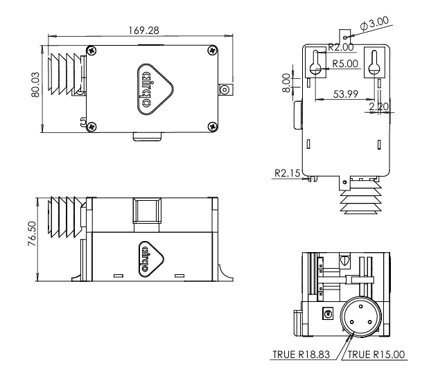

# Technical Specification

---

## 1. General Technical Specifications

| Parameter | Value |
|---|---|
| **Main Controller** | ATMEGA2560 |
| **Storage** | 256KB built-in, expandable to 32GB with external SD-Card |
| **RAM** | 2KB |
| **Battery** | 3240 mAh |
| **Charging** | Solar panel input 5–12V · 5V USB micro input |
| **Connectivity** | 2G GSM, Wi-Fi, LoRaWAN |
| **Dimensions** | 147.5 × 71.5 × 7.4 mm |
| **Weight** | 172 g |

!!! note
    These specifications are subject to change based on product updates and variations.

---

## 2. Electrical Specification

| Parameter | Value |
|---|---|
| **Input Voltage** | 5–12V |
| **Battery** | 3.7V LiPo 3.5AH *(solar-powered monitors)* · 3.7V Li-ion 8.8AH *(mobile monitors)* |
| **Power consumption** | 1.1W normal use · 0.098W save mode |
| **Current Draw** | 220mA normal use · 19.6mA save mode · 300mA during transmission |
| **Solar Panel** | 6W max power · 1.2A operating current · 5V operating voltage · 1.15A open circuit current · 6V open circuit voltage |

---

## 3. Communication Interfaces

| Parameter | Value |
|---|---|
| **Technology & Frequency** | Quad-band GSM/GPRS 2G — GSM 850MHz, EGSM 900MHz, DCS 1800MHz, PCS 1900MHz |
| **Data Accessibility** | AirQo Dashboard · AirQo API · AirQo App |

---

## 4. Technical Drawings

For detailed PCB schematics and 3D models, see the [hardware folder](https://github.com/airqo-platform/AirQo-hardware/tree/main/hardware) in the repository.

---

## Related Pages

- [Device Overview](overview.md) — Device features and air quality measurement specs
- [Firmware Overview](../firmware/overview.md) — Firmware architecture
