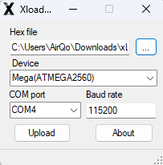

# System Maintenance

System maintenance covers scheduled procedures to keep the AirQo monitor network performing optimally.

---

## Scheduled Maintenance Procedures

### Monthly

1. **Visual inspection** — Check for physical damage, corrosion, loose cables or mounting hardware
2. **Sensor inlet cleaning** — Use a soft brush or compressed air to clear dust and debris from the PM sensor inlet
3. **Solar panel cleaning** — Wipe the solar panel surface with a clean, damp cloth to remove dust
4. **Mounting check** — Verify the device carrier bolts and pole mount are still securely fastened

### Quarterly

1. **Battery health check** — Measure battery voltage under load; replace if below 3.5V
2. **SD card inspection** — Check available storage; backup and format if >80% full
3. **GSM connectivity test** — Verify the device is reporting data to the platform
4. **Firmware version check** — Ensure the device is running the latest stable firmware release

### Annually

1. **Full system inspection** — Inspect all internal components for wear or corrosion
2. **Battery replacement** — Replace battery proactively even if still functional
3. **Sensor calibration check** — Compare sensor readings with a reference instrument if available

---

## Firmware Updates

When a new firmware version is released:

1. Download the latest firmware from the [repository releases](https://github.com/airqo-platform/AirQo-hardware/releases)
2. Connect the device via USB
3. Flash using Arduino IDE or PlatformIO — see [Firmware Configuration](../firmware/configuration.md)
4. Confirm device resumes normal operation after update

---

## Related Pages

- [Maintenance Overview](index.md)
- [Maintenance Toolkit](toolkit.md)
- [Device Diagnosis](diagnosis.md)
